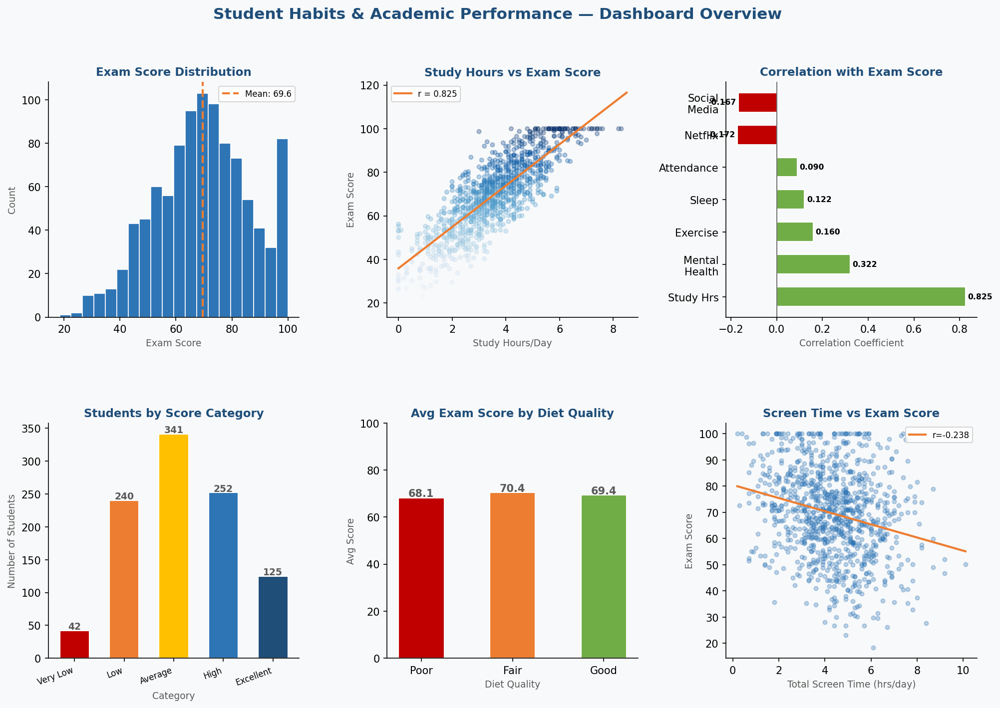
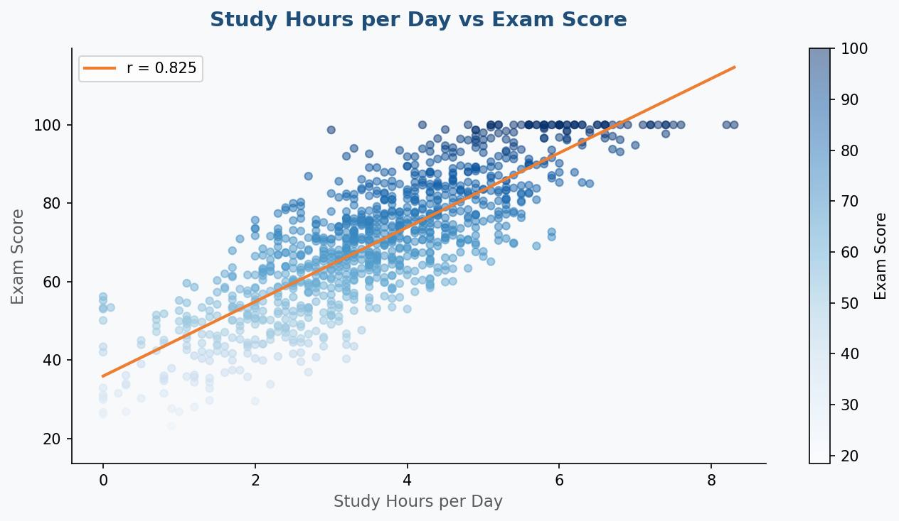
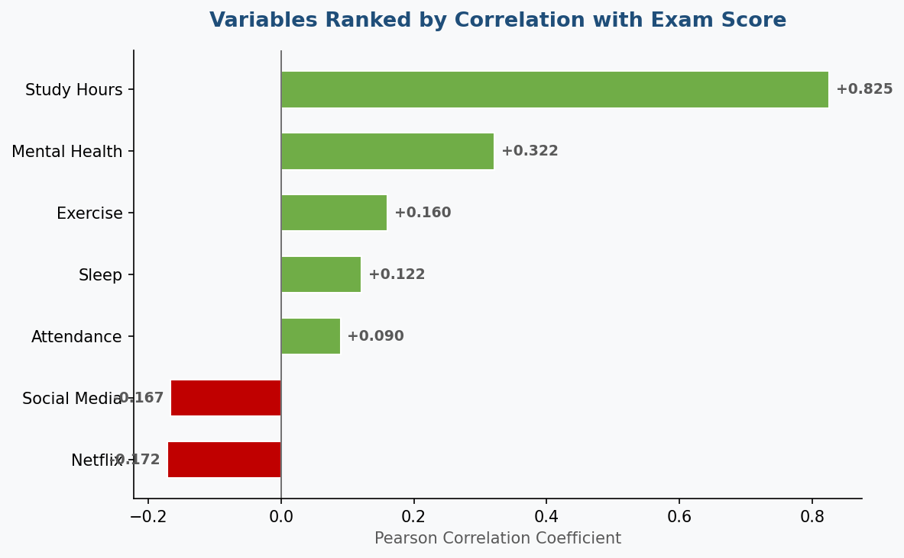
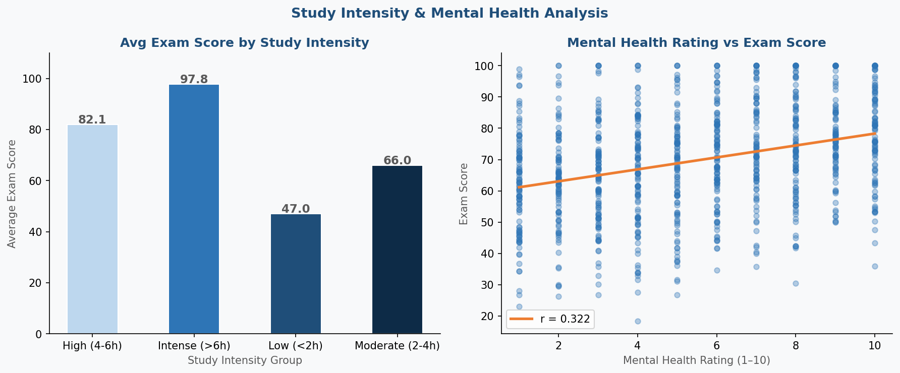
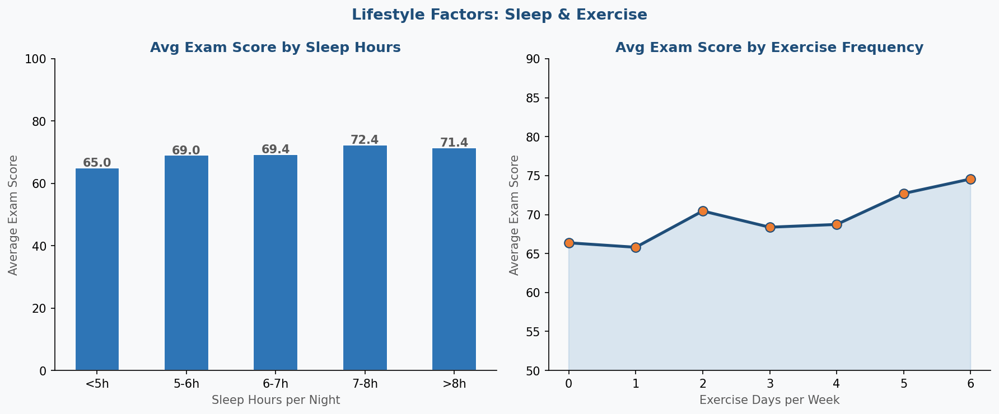
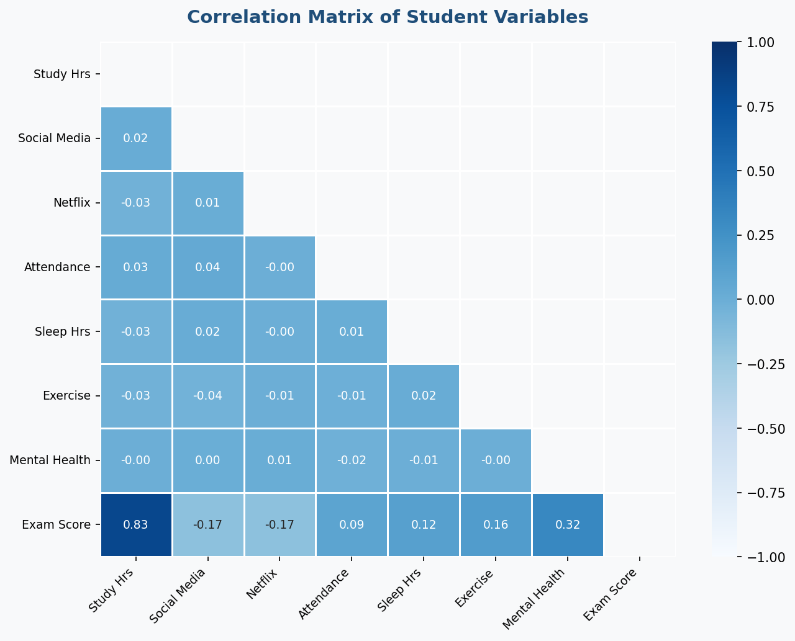
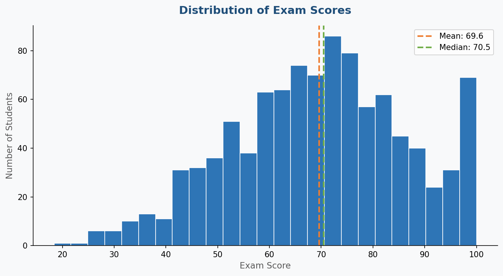
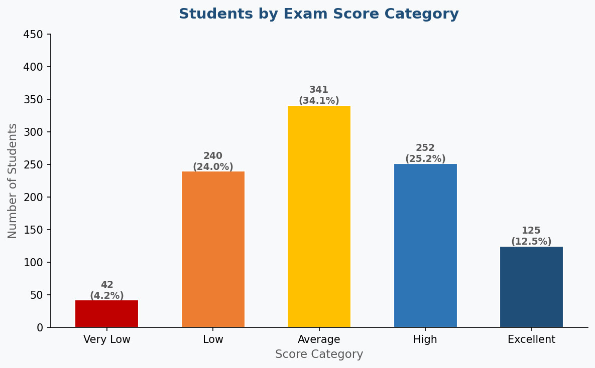
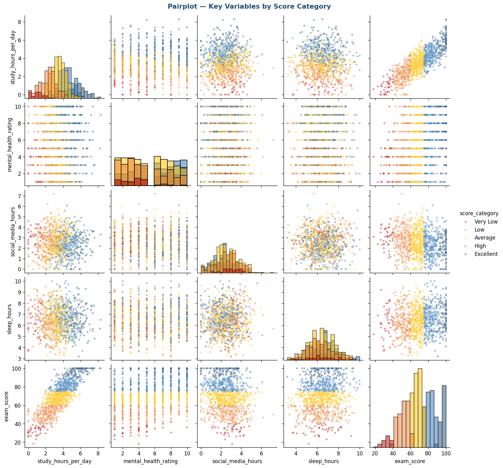

# 📊 Kebiasaan Mahasiswa & Performa Akademik
### Proyek Portofolio Descriptive Analytics

<p align="center">
  
</p>

<p align="center">
  
  
  
  
  
</p>

---

## 📌 Gambaran Proyek

Proyek ini menerapkan **Descriptive Analytics** untuk mengeksplorasi hubungan antara kebiasaan hidup mahasiswa dan performa akademik mereka. Menggunakan dataset **1.000 mahasiswa** dengan **16 variabel**, analisis ini menjawab:

> *"Kebiasaan harian dan faktor personal apa yang paling berkaitan dengan nilai ujian yang lebih tinggi?"*

**Tipe Analitik yang Digunakan: Descriptive Analytics**
Descriptive analytics merangkum data historis untuk mengungkap pola, tren, dan distribusi — menjawab pertanyaan **"Apa yang terjadi?"** Ini adalah fondasi pengambilan keputusan berbasis data dan langkah pertama sebelum menerapkan analitik diagnostik, prediktif, atau preskriptif.

---

## 🗂️ Struktur Repositori

```
student-habits-performance/
│
├── 📁 data/
│   ├── raw/
│   │   └── student_habits_performance.csv     # Dataset asli (Kaggle)
│   └── processed/
│       ├── student_habits_cleaned.csv         # Data bersih + rekayasa fitur
│       ├── summary_statistics.csv             # Statistik deskriptif
│       ├── correlation_matrix.csv             # Matriks korelasi lengkap
│       └── score_distribution.csv             # Rincian kategori nilai
│
├── 📁 notebooks/
│   └── analysis.py                            # Skrip analisis lengkap (reproducible)
│
├── 📁 visualizations/
│   ├── dashboard_overview.png                 # Dashboard ringkasan 6 panel
│   ├── chart1_distribution.png                # Histogram nilai ujian
│   ├── chart2_scatter.png                     # Jam belajar vs nilai ujian
│   ├── chart3_diet.png                        # Kualitas diet vs nilai
│   ├── chart4_heatmap.png                     # Heatmap korelasi
│   ├── chart5_boxplot.png                     # Kerja paruh waktu vs nilai
│   ├── chart6_parental_edu.png                # Pendidikan orang tua vs nilai
│   ├── chart7_pie.png                         # Distribusi jenis kelamin
│   ├── chart8_internet_gender.png             # Kualitas internet & jenis kelamin
│   ├── chart_score_categories.png             # Distribusi kategori nilai
│   ├── chart_correlation_ranked.png           # Peringkat korelasi (bar chart)
│   ├── chart_study_intensity.png              # Analisis intensitas belajar
│   ├── chart_pairplot.png                     # Pairplot multi-variabel
│   ├── study_mental_health.png                # Analisis kesehatan mental
│   └── sleep_exercise.png                     # Analisis tidur & olahraga
│
├── 📁 reports/
│   └── Laporan_Descriptive_Analytics_StudentHabits.docx   # Laporan lengkap Word (Bahasa Indonesia)
│
├── requirements.txt
└── README.md
```

---

## 📂 Dataset

| Atribut | Detail |
|---------|--------|
| **Sumber** | [Kaggle](https://www.kaggle.com) |
| **File** | `student_habits_performance.csv` |
| **Jumlah Data** | 1.000 mahasiswa |
| **Fitur** | 16 variabel |
| **Variabel Target** | `exam_score` (0–100) |
| **Nilai Kosong** | 91 (pada `parental_education_level`) |

### Deskripsi Variabel

| Variabel | Tipe | Deskripsi |
|----------|------|-----------|
| `student_id` | Kategorik | Identitas unik mahasiswa |
| `age` | Numerik | Usia mahasiswa (17–24) |
| `gender` | Kategorik | Laki-laki / Perempuan / Lainnya |
| `study_hours_per_day` | Numerik | Rata-rata jam belajar per hari |
| `social_media_hours` | Numerik | Penggunaan media sosial harian (jam) |
| `netflix_hours` | Numerik | Penggunaan Netflix/streaming harian (jam) |
| `part_time_job` | Kategorik | Apakah mahasiswa memiliki pekerjaan paruh waktu |
| `attendance_percentage` | Numerik | Persentase kehadiran kelas (%) |
| `sleep_hours` | Numerik | Rata-rata jam tidur per malam |
| `diet_quality` | Kategorik | Buruk / Cukup / Baik |
| `exercise_frequency` | Numerik | Hari olahraga per minggu |
| `parental_education_level` | Kategorik | SMA / Sarjana / Magister |
| `internet_quality` | Kategorik | Buruk / Rata-rata / Baik |
| `mental_health_rating` | Numerik | Penilaian kesehatan mental mandiri (1–10) |
| `extracurricular_participation` | Kategorik | Ya / Tidak |
| `exam_score` | Numerik | **Target** — Nilai ujian akhir (0–100) |

---

## 📊 Temuan Utama

### 🔑 1. Jam Belajar adalah Faktor Dominan (r = 0,825)

<p align="center">
  
</p>

Jam belajar per hari memiliki **korelasi positif yang sangat kuat (r = 0,825)** dengan nilai ujian — jauh melampaui semua variabel lainnya. Mahasiswa yang belajar 6+ jam/hari secara konsisten mendapat nilai di atas 80.

---

### 📈 2. Peringkat Korelasi

<p align="center">
  
</p>

| Variabel | Korelasi | Interpretasi |
|----------|----------|--------------|
| Jam Belajar/Hari | **+0,825** | Positif Sangat Kuat |
| Penilaian Kesehatan Mental | **+0,322** | Positif Sedang |
| Frekuensi Olahraga | **+0,160** | Positif Lemah |
| Jam Tidur | **+0,122** | Positif Lemah |
| Persentase Kehadiran | **+0,090** | Positif Sangat Lemah |
| Jam Netflix | **–0,172** | Negatif Lemah |
| Jam Media Sosial | **–0,167** | Negatif Lemah |

---

### 🧠 3. Kesehatan Mental & Intensitas Belajar

<p align="center">
  
</p>

Mahasiswa dengan penilaian kesehatan mental yang lebih tinggi dan jadwal belajar yang lebih intensif mencapai hasil ujian yang jauh lebih baik.

---

### 🥗 4. Faktor Gaya Hidup Berpengaruh

<p align="center">
  
</p>

Kualitas diet, kebiasaan tidur, dan frekuensi olahraga semuanya menunjukkan tren positif terhadap performa ujian — memperkuat pentingnya gaya hidup yang seimbang.

---

### 🔥 5. Heatmap Korelasi

<p align="center">
  
</p>

---

### 📦 6. Distribusi Nilai

<p align="center">
  
</p>

| Statistik | Nilai |
|-----------|-------|
| Rata-rata | 69,60 |
| Median | 70,50 |
| Std Dev | 16,89 |
| Min | 18,4 |
| Maks | 100,0 |

<p align="center">
  
</p>

---

### 🔍 7. Pairplot Multi-Variabel

<p align="center">
  
</p>

---

## 🛠️ Cara Menjalankan

### 1. Clone Repositori
```bash
git clone https://github.com/yourusername/student-habits-performance.git
cd student-habits-performance
```

### 2. Install Dependensi
```bash
pip install -r requirements.txt
```

### 3. Jalankan Analisis
```bash
cd notebooks
python analysis.py
```
Semua grafik akan disimpan ke `visualizations/` dan data yang telah diproses ke `data/processed/`.

---

## 📦 Persyaratan

```
pandas>=1.5.0
numpy>=1.23.0
matplotlib>=3.6.0
seaborn>=0.12.0
```

---

## 💡 Pendekatan Analitik

Proyek ini menggunakan **Descriptive Analytics**, yang:
- Merangkum data historis menggunakan ukuran statistik (rata-rata, median, standar deviasi, persentase)
- Mengidentifikasi pola dan korelasi antar variabel
- Menyajikan temuan melalui visualisasi yang informatif
- **Tidak** memprediksi hasil di masa depan (itu adalah Predictive Analytics)
- **Tidak** menjelaskan akar penyebab masalah (itu adalah Diagnostic Analytics)

---

## ❓ Sesi Tanya Jawab

### P1: Mengapa penting untuk mengidentifikasi pertanyaan sebelum memulai proyek?

Mendefinisikan pertanyaan analitik yang jelas sebelum memulai sangat penting karena:
- **Memfokuskan analisis** — mencegah pemborosan waktu pada eksplorasi data yang tidak relevan
- **Memandu pemilihan metode** — pertanyaan menentukan jenis analitik mana (deskriptif, diagnostik, prediktif, preskriptif) yang tepat
- **Menghemat sumber daya** — menghindari pengumpulan/pembersihan data yang tidak akan digunakan
- **Memungkinkan pengukuran keberhasilan** — kamu tahu kapan analisis sudah "selesai"
- **Meningkatkan komunikasi** — pemangku kepentingan memahami output ketika langsung menjawab pertanyaan yang telah dinyatakan

Dalam proyek ini, pertanyaan panduan adalah: *"Kebiasaan apa yang paling berkaitan dengan nilai ujian yang lebih tinggi?"* — yang mengarahkan setiap keputusan analitik dan visualisasi.

### P2: Sumber Data Terbuka untuk Analisis

Dataset untuk proyek ini diunduh dari **[Kaggle](https://www.kaggle.com)**.

Sumber data terbuka terkemuka lainnya meliputi:

| Sumber | URL | Deskripsi |
|--------|-----|-----------|
| **Kaggle** ⭐ *(digunakan di sini)* | kaggle.com | Ribuan dataset dari berbagai bidang |
| **UCI ML Repository** | archive.ics.uci.edu | Dataset ML & statistik klasik |
| **Google Dataset Search** | datasetsearch.research.google.com | Mesin pencari untuk dataset |
| **Data.gov** | data.gov | Data terbuka pemerintah AS |
| **World Bank Open Data** | data.worldbank.org | Data ekonomi & sosial global |
| **Our World in Data** | ourworldindata.org | Data pembangunan & kesehatan global |
| **Statista** | statista.com | Statistik industri & survei |

---

## 📄 Lisensi

Proyek ini dibuat untuk keperluan edukasi dan portofolio. Dataset berasal dari Kaggle.

---

<p align="center">
  Dibuat dengan ❤️ menggunakan Python · pandas · matplotlib · seaborn
</p>
